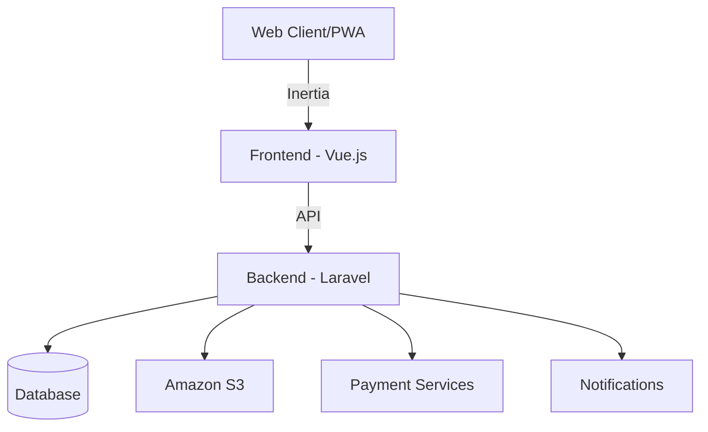
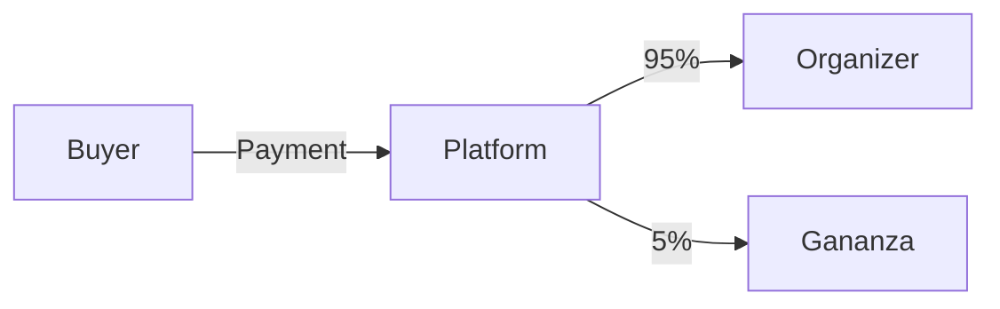
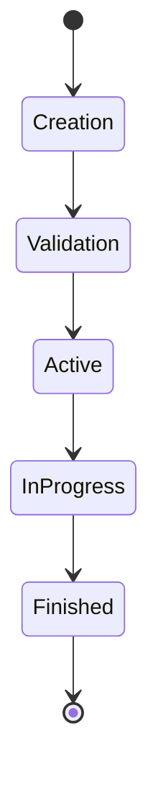

# 📱 Gananza Project - General and Technical Documentation

## 📋 Table of Contents

1. [Project Overview](#project-overview)
2. [Project Objectives](#project-objectives)
3. [Technical Specifications](#technical-specifications)
4. [System Architecture](#system-architecture)
5. [Roles and Permissions](#roles-and-permissions)
6. [Main Features](#main-features)
7. [Workflow](#raffle-lifecycle)
8. [Business Model](#business-model)
9. [Legal Requirements](#legal-requirements)
10. [Infrastructure and Deployment](#infrastructure-and-deployment)

---

## 🎯 Project Overview

### Project Description

Gananza is a web platform that serves as an intermediary for organizing and participating in raffles, allowing users from anywhere in the world to create and participate in virtual, traditional (in-person), or hybrid raffles.

### Types of Raffles

- 🌐 Virtual
- 👥 Traditional (in-person)
- 🔄 Hybrid

### Target Audience

1. Raffle organizers
2. Ticket buyers
3. Unregistered users (viewing)

---

## 🎯 Project Objectives

### Main Objectives

- Facilitate the creation and management of raffles
- Provide a secure platform for ticket purchases
- Automate ticket pricing and quantity calculation
- Ensure legal compliance for raffles
- Offer an intuitive user experience

### KPIs

- Number of raffles created
- Volume of tickets sold
- User conversion rate
- Average raffle completion time
- User satisfaction

---

## 💻 Technical Specifications

### Technology Stack

| Component       | Technology         |
| ---------------- | ------------------ |
| Backend          | PHP/Laravel        |
| Frontend         | Vue.js + Inertia   |
| CSS Framework    | TailwindCSS        |
| Database         | MySQL              |
| Authentication   | OAuth (Google, Apple) |
| 2FA               | SMS                |

### Integrations

- 💳 Payment Gateways: Nequi, PSE
- 📨 Notifications: SMS, Email, WhatsApp (Desirable)
- ☁️ Storage: Amazon S3

### PWA

- Installable on mobile devices
- Offline functionality (desirable)
- Responsive design

---

## 🏗️ System Architecture

### Architecture Diagram

### Main Components

1. Frontend
    - Vue.js Components
    - Inertia Pages
    - TailwindCSS
2. Backend
    - REST API
    - Authentication Middleware
    - Business Services
    - Auditing

---

## 👥 Roles and Permissions

### User Types

| Role          | Permissions                                                              |
| ------------- | ----------------------------------------------------------------------- |
| Admin         | Full system management, Real-time monitoring, User management, Financial reporting |
| Organizer     | Create raffles, Manage own raffles, Buy tickets, View statistics         |
| Client        | Buy tickets, View available raffles, Manage profile                     |
| Unregistered  | View public dashboard, View available raffles                           |

---

## ⚙️ Main Features

### Raffle Management

1. Raffle Creation
    - Prize registration
    - Image validation
    - Detailed description
    - Monetary goal configuration
2. Automatic Calculation
    - Suggested number of tickets
    - Ticket price calculation
    - Parameter adjustment
3. Validations
    - Legal age
    - Legal authorizations
    - User verification

### Payment System

1. Nequi Integration
2. PSE Integration
3. Transaction recording
4. Payment auditing

---

## 📈 Business Model

### Revenue Structure

- 5% commission per organized raffle
- Processed through Nequi business account

### Fund Flow

---

## ⚖️ Legal Requirements

### Amount-based Validations

| Amount     | Requirement            |
| ---------- | ---------------------- |
| < 2M COP   | Municipal authorization |
| > 2M COP   | Coljuegos permit       |

### Required Documentation

- Verified identity
- Legal age
- Permits based on amount
- Terms and conditions

---

## 🚀 Infrastructure and Deployment

### CI/CD

- Automated pipeline
- Automated tests
- Continuous deployment

### Monitoring

- Integration with Discord
- Real-time alerts
- Performance metrics

### Security

- Two-factor authentication
- OAuth
- Action auditing
- Encryption of sensitive data

### Backup and Recovery

- Automatic backups
- Recovery procedures
- Data redundancy

---

## 📱 PWA Specifications

### Features

- Installable on mobile devices
- Important data caching
- Push notifications
- Background synchronization

### Offline Functionality

- Access to saved raffles
- Image caching
- Later synchronization

---

## 🔄 Raffle Lifecycle

1. Creation
    - Detail registration
    - Parameter configuration
    - Image upload
2. Validation
    - Legal verification
    - Amount validation
    - Documentation review
3. Active
    - Ticket sales
    - Progress monitoring
    - Notifications
4. Finished
    - Winner selection
    - Prize distribution
    - Transaction closure

---

## 📊 Metrics and Analytics

### Key KPIs

- Conversion rate
- Average sales time
- User retention
- Customer satisfaction

### Reports

- Daily sales
- Active users
- Successful raffles
- Generated revenue

---

## 🔜 Roadmap

### Phase 1 (MVP)

- [ ] Basic authentication
- [ ] Raffle creation
- [ ] Ticket purchase
- [ ] Basic payments

### Phase 2

- [ ] WhatsApp integration
- [ ] Offline functionality
- [ ] Advanced analytics
- [ ] Gamification

### Phase 3

- [ ] International raffles
- [ ] Blockchain integration
- [ ] Public API
- [ ] Prize marketplace