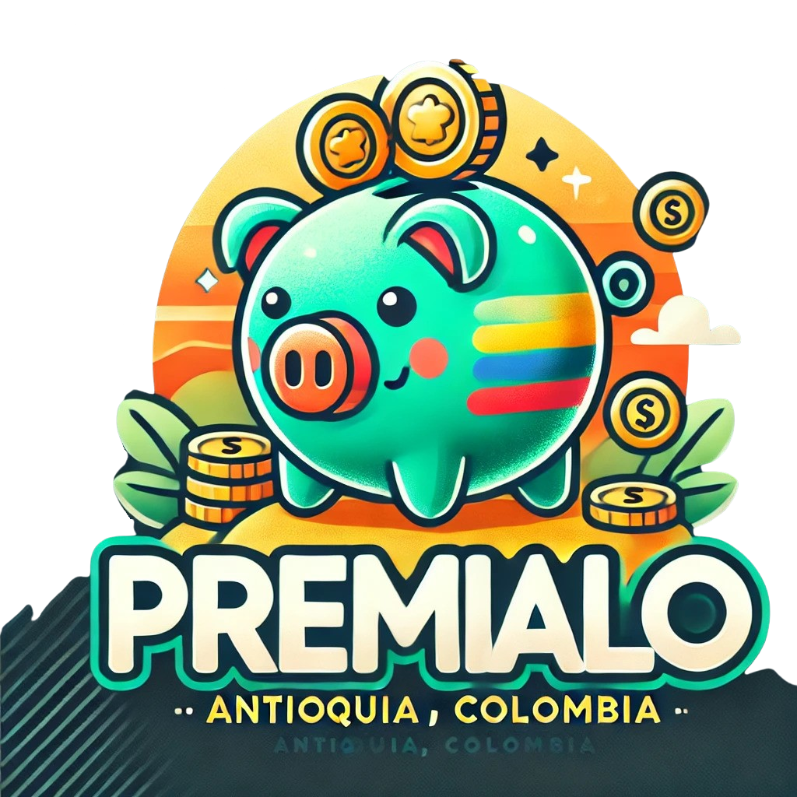

# 🏆 Branding de Premialo

---

## 📋 Executive Summary

- *Premialo* is an online raffle service offering transparency, accessibility, and trust.  
- **Purpose**: To lead the online raffle market in Antioquia, providing a secure platform for adults seeking to win in an entertaining and responsible way.

---

## 🎨 Brand Identity

- **Name**: *Premialo*  
- **Slogan**: "Participa y celebra"  
- **Tone of Voice**: Empathetic, accessible, and trustworthy, with a touch of enthusiasm.

## 👀 Visual Identity

- **Logo**:

- **Color Palette**:
    -  **Green (#2ECC71)**: Success and growth, evoking prosperity and positivity.
    -  **Yellow (#F1C40F)**: Energy and optimism, symbolizing wealth and joy.
    -  **Orange (#E67E22)**: Trust and action, inviting enthusiasm and creating a welcoming atmosphere.

    **Full Palette**: [Coolors](https://coolors.co/2ecc71-e67e22-fafffc-f1c40f)

- **Typography**:  
    - **Quicksand**: For headers and highlights.  
    - **Open Sans**: For body text and general content.

---

## 🎯 Vision

To become the leading online raffle platform in Colombia, delivering a trustworthy, accessible, and fun entertainment experience, recognized for transparency and user satisfaction.

## 🌟 Mission

To provide a safe and accessible online raffle platform, enabling users to participate with confidence and ease. We promote transparency in every draw, fostering the excitement of winning while building a responsible and trustworthy community.

---

## 📈 Brand Values

1. **Innovation**: Continuous improvement in technology and service.  
2. **Sustainability**: Commitment to responsible practices.  
3. **Quality**: Reliable and secure service.  
4. **Accessibility**: Easy-to-use platform open to everyone.  
5. **Diversity**: Inclusive environment for all eligible participants.

---

## 👥 Target Audience

- **Age**: 18+  
- **Interests**: Online raffles.  
- **Location**: Antioquia.  

---

## ✨ Unique Benefits

1. **Total Transparency**: Security in winner selection.  
2. **Inclusive Access**: Equal opportunities without restrictions.  
3. **Community Interaction**: User-focused improvements and engagement.

---

## 📱 Content Strategy

1. **Social Media**:  
    - Posts on Facebook, Instagram, and Twitter about active raffles, results, and winner testimonials.

2. **Success Stories**:  
    - Narratives of winners whose lives were transformed, adding a human touch to our brand.

3. **Educational Content**:  
    - Guides on responsible online gaming and safe participation tips.

4. **Newsletter**:  
    - Monthly updates on special raffles and reminders of responsible participation.

---

## 📢 Call to Action (CTA)

**"¡Participa ahora y gana con Premialo!"**  
Encourages immediate participation, promising a positive and rewarding experience.

---

## 📡 Communication Channels

- **Online Ads**:  
    - Google Ads, Facebook Ads, and banners on relevant websites.  

- **Social Media**:  
    - Community building on key platforms.  

- **Official Website**:  
    - Central hub for active raffles and results.

---

## 🎯 Objectives

1. **Increase Participation**:  
    - Boost the number of participants through engaging content and advertising strategies.  

2. **Build Brand Recognition**:  
    - Position *Premialo* as the most reliable online raffle platform in Antioquia.  

3. **Foster Loyalty**:  
    - Develop a loyal community that enjoys and trusts every raffle.

---
