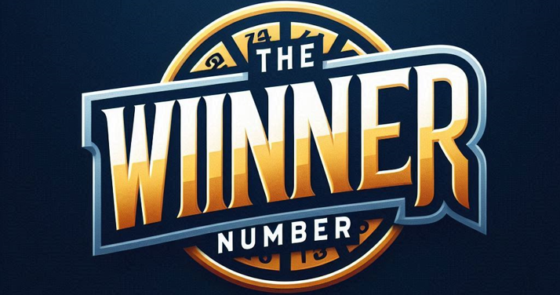

THE WINNER NUMBER
==================

## INTEGRANTES

    - Andrés Cano Rave.
    - Julian  Alvarez Valencia.
    - Juan Zapata Barrera.         	  	

***Riwi Campo de entrenamiento de software.***

Medellín 2024

## MODELO DE NEGOCIO

#### Fuentes de Ingreso:
Comisiones por Transacciones: Cobrar una comisión sobre cada boleto vendido en las rifas organizadas a través de la plataforma (por ejemplo, entre el 10% del valor de cada boleto).
#### Publicidad: 
Ofrecer espacios publicitarios dentro de la aplicación, permitiendo que empresas promocionen sus productos o rifas destacadas a la audiencia.

## REQUERIMIENTOS

### Funcionales 

- Diseñar y crear un inicio de sesión y registro para los usuarios que quieran comprar o gestionar rifas, utilizando la autenticación Oauth, lo que permitiría iniciar sesión con alguna cuenta de red Social (Google, Discord etc.), 
Generar roles de administrador, creador, cliente y usuario con los permisos de crear, leer, actualizar, eliminar y desactivar (archivar) cuentas. 
- Permitir a los usuarios registrados y no registrados (público general) poder ver las rifas públicas que están activas actualmente en la aplicación.
- A los usuarios registrados en la plataforma se les dará la opción de escoger entre dos roles, clientes y organizadores, y ambos roles podrán ver las rifas.
- Los usuarios que no estén autenticados pueden ver la rifas que estén activas pero para comprarlas tienen que autenticarse
Los usuarios con el rol de cliente pueden ver las diferentes rifas y comprar algún número de una rifa en específico.
- Los organizadores pueden crear rifas (asignar la lotería para jugar con las dos últimas cifras), eliminar y actualizar (siempre y cuando no se hayan vendido boletas), gestionarlas (estadísticas), asignarles precio y finalmente, publicarlas.
- Los usuarios que quieran ser organizadores pueden hacerlo en dos apartados: 
    - el primero es a la hora de registrarse donde escoge si es cliente regular u organizador.
    - el otro apartado es cuando el usuario habiendo escogido el rol de Cliente (donde solo va a comprar rifas) quiera actualizarse a rol de Organizador en un apartado del menú o perfil de usuario.  
- Para la compra de los números de las rifas, se implementará un sistema de pago por Nequi (se tendrán en cuenta otras opciones posibles). También se manejaran las transacciones de los organizadores y la ganancia de la aplicación por nequi o PSA.
- Consumir una API de loterías de antioquia para obtener los resultados(las últimas dos cifras de cada lotería) y de esa manera determinar el o los ganadores.

### No Funcionales

- Rendimiento y Escalabilidad
- Seguridad
    - La autenticación Oauth debe cumplir con los estándares de seguridad y contar con protección contra ataques como phishing, fuerza bruta y hijacking de sesión.
    - Debe implementarse un sistema de permisos para limitar el acceso a datos y funcionalidades críticas solo a usuarios autorizados, en función de su rol (administrador, cliente, organizador).
    - Debe contar con políticas de bloqueo de cuentas después de varios intentos fallidos de inicio de sesión para evitar ataques de fuerza bruta.
- Compatibilidad La plataforma 
    - Debe ser compatible con los principales navegadores (Chrome, Firefox, Safari, Edge) y dispositivos móviles y de escritorio, asegurando una experiencia consistente.
    - Debe adaptarse a distintos tamaños de pantalla (diseño responsivo) para garantizar una experiencia de usuario fluida tanto en dispositivos móviles como en escritorio.
- Disponibilidad y Confiabilidad 
    - Debe contar con mecanismos de respaldo diario de bases de datos y recuperación en caso de desastres, con tiempos de recuperación de servicio no mayores a 30 minutos en caso de fallo.
    - Implementar un sistema de monitoreo en tiempo real que alerte sobre problemas de funcionamiento, errores de pago o interrupciones de servicio.
- Usabilidad y Experiencia de Usuario (UX) 
    - La interfaz debe ser intuitiva y accesible, con un flujo de navegación claro tanto para clientes como para organizadores.
    - La compra de rifas debe ser un proceso simplificado, requiriendo la menor cantidad de pasos posible para mejorar la conversión de ventas.
- Integración y APIs Externas La integración con la API de Loterías de Antioquia
    - Debe garantizar la actualización de resultados en tiempo real, verificando los números ganadores sin intervención manual.
- Legal y Cumplimiento 
    - Cumplir con las normativas locales e internacionales para rifas y sorteos, además de las leyes de protección de datos como la Ley de Protección de Datos de Colombia o el GDPR si es necesario.
    - Los usuarios deben aceptar términos y condiciones de uso y políticas de privacidad para usar la plataforma.
    - Todos los pagos deben cumplir con los estándares PCI-DSS (Payment Card Industry Data Security Standard) para transacciones seguras.

### Complementarios

- Generar un QR cuando el rol organizador cree una rifa y de esta manera facilitar la visualización para los usuarios
Crear una mascota virtual como apartado adicional que te ayude a responder a las preguntas más frecuentes acerca del sitio web.
- Crear nuestras propias rifas personalizadas donde se promocionen ciertos premios de diferentes marcas.
Crear rifas personalizadas para influencers o figuras públicas.
- Sistema de calificación de los organizadores donde se determine la calidad de éste.

## FLUJO DE TRABAJO

### Fase 1 
- Requerimientos Funcionales (Alta Prioridad)
- Autenticación y Registro
- Diseñar y crear el sistema de inicio de sesión y registro mediante autenticación OAuth, permitiendo el acceso con redes sociales como Google y Discord.
- Desarrollar la opción para que los usuarios elijan roles al registrarse (cliente u organizador).
- Gestión de Roles y Permisos, crear el sistema de roles (administrador, creador/organizador, cliente y usuario), con permisos asociados: Crear, Leer, Actualizar, Eliminar y Desactivar cuentas.
- Implementar las funcionalidades de cambio de rol para permitir que los clientes actualicen su rol a organizador desde su perfil o menú de usuario.
- Visualización de Rifas
    - Configurar la interfaz para que tanto usuarios registrados como no registrados puedan ver las rifas públicas activas.
    - Asegurar que la compra de rifas esté habilitada solo para usuarios autenticados.
- Funcionalidades del Cliente
    - Permitir a los clientes ver las rifas activas y comprar números de una rifa específica.
- Funcionalidades del Organizador
    - Crear funcionalidades para que los organizadores creen rifas, definan precios, asignen la lotería, y publiquen.
    - Implementar la opción de actualización y eliminación de rifas (solo si no tienen boletos vendidos).
    - Crear una sección de estadísticas para la gestión y análisis de rifas por parte de los organizadores.
- Gestión de Pagos
    - Implementar el sistema de pagos con Nequi para la compra de boletos de rifas.
    - Desarrollar el sistema para manejar las transacciones de los organizadores y la ganancia de la aplicación.
- Consumo de la API de Resultados de Lotería
    - Configurar el consumo de la API de Loterías de Antioquia para obtener los resultados de las dos últimas cifras de cada sorteo y determinar los ganadores de cada rifa.

### Fase 2 
- Requerimientos Complementarios (Prioridad Media).
- Generación de QR para Rifas.
- Crear la funcionalidad para generar un código QR cuando un organizador publique una nueva rifa, facilitando su visualización y promoción entre los usuarios.

### Fase 3 
- Requerimientos No Funcionales (Prioridad Baja)
- Seguridad de Autenticación y Acceso
    - Asegurar que la autenticación OAuth cumpla con los estándares de seguridad y protección contra ataques como phishing, fuerza bruta y hijacking de sesión.
    - Implementar un sistema de permisos para controlar el acceso a datos y funcionalidades según el rol de cada usuario.
- Protección contra Ataques
    - Configurar una política de bloqueo de cuentas después de varios intentos fallidos de inicio de sesión para prevenir ataques de fuerza bruta.

## BRANDING

### Definición de los objetivos del proyecto

#### ¿Para qué existe el proyecto?
The Winner Number existe para transformar el mercado tradicional de rifas en Antioquia, ofreciendo una plataforma digital segura, transparente y emocionante que conecte a los participantes con oportunidades de ganar premios de manera legal y regulada.

#### Público objetivo
- Demográfico: Adultos mayores de 18 años residentes en Antioquia.
- Psicográfico:
    - Personas con interés en juegos de azar y rifas.
    - Individuos que buscan oportunidades de ganar premios de forma segura.
    - Usuarios familiarizados con tecnología básica.
    - Personas con capacidad adquisitiva media que buscan entretenimiento.

#### Identidad y valores de la marca
- ***Misión:*** "Proporcionar una plataforma digital innovadora y confiable que revolucione la experiencia de participar en rifas, garantizando transparencia, seguridad y emoción en cada sorteo, mientras contribuimos al entretenimiento responsable en Antioquia."
- ***Visión:*** "Ser reconocidos para 2026 como la plataforma líder de rifas digitales en Antioquia, distinguiéndonos por nuestra innovación tecnológica, transparencia y compromiso con la satisfacción del usuario, expandiendo progresivamente nuestra presencia a nivel nacional."
- ***Valores de la marca:***

    - ***Transparencia:*** Procesos claros y verificables.
    - ***Integridad:*** Cumplimiento de promesas y normativas.
    - ***Innovación:*** Mejora continua de la experiencia digital.
    - ***Seguridad:*** Protección de datos y transacciones.
    - ***Responsabilidad:*** Promoción del juego consciente.
    - ***Confiabilidad:*** Garantía en cada proceso.

- ***Personalidad de la marca:***
    - Moderna y tecnológica.
    - Confiable y profesional.
    - Cercana y amigable.
    - Dinámica y emocionante.
    - Responsable y ética.

Transmite aspiración y posibilidad
Conecta emocionalmente con el deseo de progreso
Sugiere que cada participación es una oportunidad.

## ESTRATEGIA DE MARKETING Y LANZAMIENTO
- Pre-lanzamiento (2 meses):
Campaña de expectativa en redes sociales
Landing page con cuenta regresiva
Registro anticipado con beneficios especiales
Alianzas estratégicas con influencers locales
Campaña de email marketing para early adopters.
- Lanzamiento:
Evento virtual de inauguración
Promoción especial de apertura
Campaña publicitaria en medios locales
Activaciones en centros comerciales de Antioquia
Sorteo inaugural con premio especial.
- Post-lanzamiento:
Programa de referidos
Contenido educativo sobre uso de la plataforma
Campañas de fidelización
Recolección y análisis de feedback
Optimización continua de la experiencia.

### Evaluación y Adaptación
- ***Métricas clave:***
Número de usuarios registrados
Tasa de conversión
Retención de usuarios
Satisfacción del cliente
Volumen de transacciones.
- ***Procesos de adaptación:***
Análisis mensual de métricas
Encuestas de satisfacción
Focus groups trimestrales
Actualización de características según feedback
Optimización de procesos operativos.

## APLICACIÓN DE LA MARCA EN EL PRODUCTO
### Diseño de la interfaz de usuario (UI)
- Paleta de colores
    - ***Azul real:*** Confianza y profesionalismo.
    - ***Dorado:*** Éxito y premium.
    - ***Blanco:*** Claridad y limpieza.

- Tipografía moderna y legible.
- Diseño responsive y adaptativo.
- Iconografía clara y consistente.
- Elementos visuales que transmiten dinamismo.
- Experiencia de usuario (UX):
    - Registro simplificado.
    - Navegación intuitiva.
    - Proceso de compra en 3 pasos (revisar este proceso).
    - Notificaciones personalizadas.
    - Dashboard personalizado.
    - Historial de participaciones.

Este branding está diseñado para posicionar a "The Winner Number" como una plataforma moderna, confiable y emocionante en el mercado de rifas digitales, con un fuerte enfoque en la experiencia del usuario y el cumplimiento normativo.

### Logo

### mascota Winnu

### Slogan 
***"Your ticket to success"***
